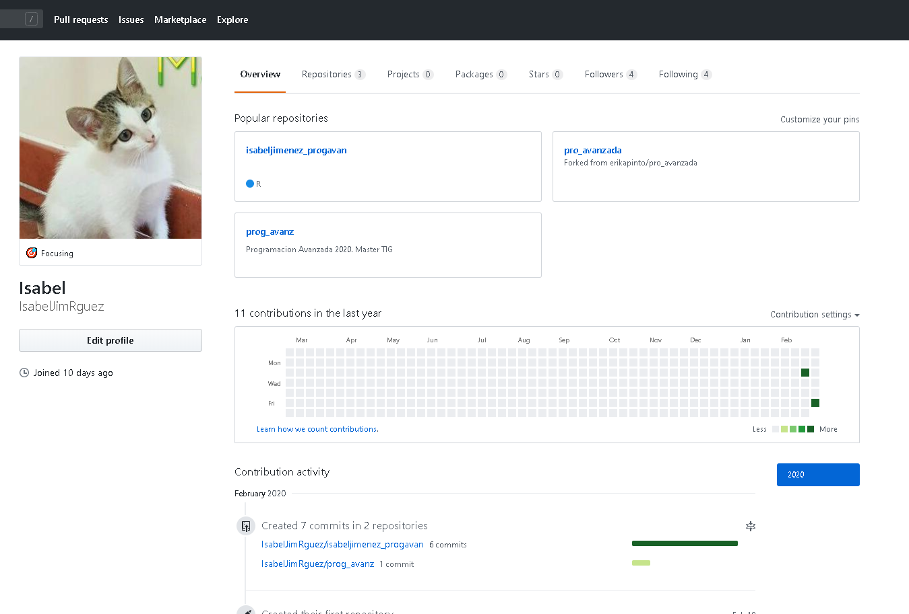
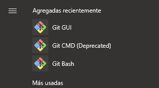
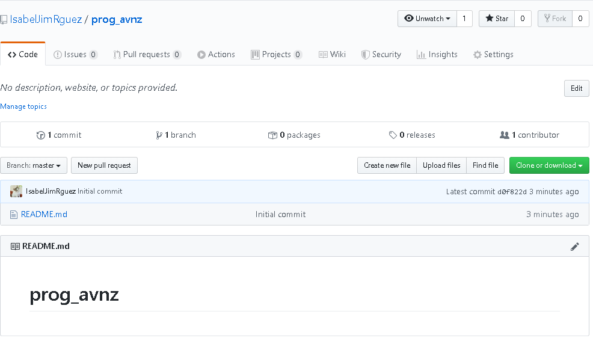
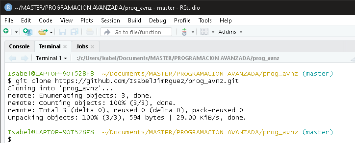
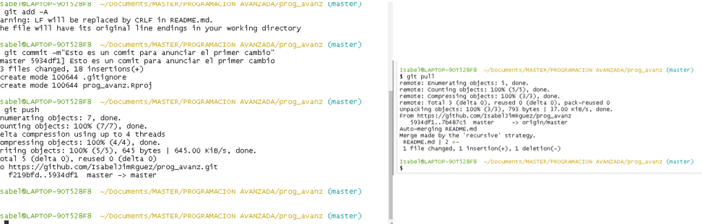
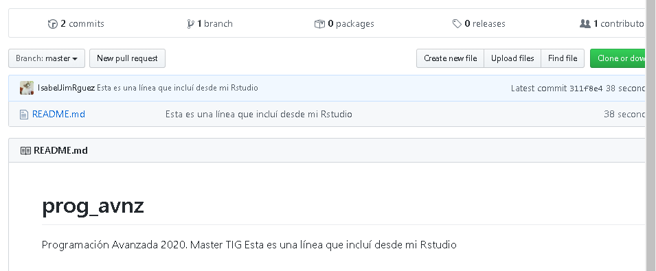

```{r setup, include=FALSE}
knitr::opts_chunk$set(echo = TRUE)
```
# Alumnos:
Stanciu Andy e Isabel Jiménez Rodríguez. 

# Fecha entrega:


# Práctica 2 – GitHub y Ciencia Reproducible  
Lee el siguiente artículo:  

https://www.revistaecosistemas.net/index.php/ecosistemas/article/viewFile/1178/973  

## 2.1. Responde a las siguientes preguntas:  
**¿Qué es la Ciencia Reproducible? ¿En qué casos se consigue un 100% de la reproducibilidad?**  
La Ciencia Reproducible la comprenden aquellos estudios acompañados de  un código que permiten obtener los rsultados que se comentan en el propio artículo, permitiendo que los datos aoportados puedan ser comprobados y determinar la veracidad o no de los resultados, así como poder revisar la metodlogía de una forma más certera.  
El 100% de reproducibilidad se da en trabajos que integren códigos y datos que permitan obtener los mismo resultados que se han obtenido en el trabajo en si,  @rodriguez2016ciencia  

**¿Cuáles de los beneficios que se sugieren son para ti los más importantes? Justifica tu respuesta**  
El principal beneficio que aporta la Ciencia Reproducible es el hecho de saber exactamente como se ha ejecutado la metodología de un trabajo. Como bien se menciona en el artículo, muchas veces se pueden leer metodologías muy interesantes que pueden solucionar un problema en cuestión, pero qué no se pueden reproducir porque con el aparatado de metodología no queda sufucientemente claro que pasos han seguido. No obstante, si se aporta el código puede ser reproducido con datos diferentes e incluso adaptarlos a nuevas necesidades, permitiendo un ahorro y eficiencia del trabajo y  tiempo. Otra gran ventaja que tiene la Ciencia reporducible es que se puede tratar bases de datos, explotarlas y generar figuras con esos resultados, a la vez que explicarlos mediante texto solamente usando un solo programas, facilitando y economizando la creación de conocimiento.    

**¿Por qué no hace todo el mundo Ciencia Reproducible?**  

La Ciencia Reproducible a pesar de aportar muchas ventajas requiere de una formación mínima en programación, manejo de base de datos y sistemas de control de versiones, @rodriguez2016ciencia, lo que requiere de un tiempo y esfuerzo que del que no muchos están dispuestos a dar.  


\pagebreak 

## 2.2. Lee el artículo “¿Por qué usar GitHub? Diez pasos para disfrutar de GitHub y no morir en el intento” @prieto2018que Realiza las siguientes tareas:  
<br />   <!--Este codigo permite hacer un salto de linea-->

 * 1.	Crea una cuenta en GitHub   


 

 * 2.	Instala Git: https://happygitwithr.com/install-git.html    

 
 * 3.	Preséntate: https://happygitwithr.com/hello-git.html   
 
```{r}
# Primero debes instalar el paquete "usethis"hh
# install.packages("usethis")
# Se debe invocar el paquete
# Seguidamente usar la funcion use_git_config.
# el user name puede ser disntinto al de github, per
# pero el correo debe ser el mismo. 

library(usethis)
use_git_config(user.name= "IsabelJimRguez",
               user.email="isabel.jimenezr@edu.uah.es")

```

<br />
   
 * 4.	Crea un repositorio en GitHub, haz un clon del repositorio y confirma que puedes push/pull desde la línea de comandos:  https://happygitwithr.com/push-pull-github.html#push-pull-github           
 

 
 
 
 
 
 * 5.	Conecta Rstudio a Git y Github: con el repositorio de GitHub clonalo a tu ordenador usando Rstudio.    
 https://happygitwithr.com/rstudio-git-github.html#rstudio-git-github.  
 
 * 6.	Introducir en el archivo README.md “Esta es una línea que incluí desde mi Rstudio” y comete los cambios (commit), posteriormente “push” a GitHub y comprueba que los cambios se realizaron correctamente en la nube.     
 
 * 7.	Crea un nuevo archivo para las clases del bloque 3 y sálvalo en GitHub. ¡Ahora puedes tener todos tus códigos en la nube y trabajar fácilmente en grupo!     
 

 
## 2.3. Lee “¿Por qué usar GitHub? Diez pasos para disfrutar de GitHub y no morir en el intento”. Comprueba que tienes “claro” los siguientes conceptos:         
<br />  

**Repositorio**    Los repositorios son los directorios dentro de la nube de GitHub donde se guardan los documentos que son subidos a GitHub. Se puede tener más de un repositorio, por lo que se puede trabajar en varios proyectos.   

**Rama**    Las ramas son versiones de un mismo script pero que no modifican al scripot principal, permitiendo hacer pruebas o versiones sobre una mismo script base. Las ramas pueden volver a unirse a la rama principal mediante el comando "compare and pull request".   

**Pull and push**     Los comandos pull y push permiten descargar en el Git de escritorio un script que está en el repositorio de la nube de GitHub, mientras que push permite enviaelo.       

**Fork**     Este comando permite descargar repositorios ajenos desde Github a nuestro propio perfil de GitHub, los cuales pueden ser modificados.     


## 2.4. RMarkdown. Genera un documento de html que contenga  
<br />  
 
 * 1.	Todas las opciones de sintaxis básicas de Pandoc Markdown: texto plano, cursiva, negrita, superíndice, subíndice, tachado, link, ecuación en línea de texto, ecuación en bloque, diferentes encabezados.    
   + texto plano    
   + *cursiva*    
   + **negrita**    
   + superíndice^2^    
   + subíndice~2~    
   + ~~tachado~~    
   + [Si se clickea sobre esta frase se abrirá una pestaña en Google](https://www.google.com/webhp?hl=es&sa=X&ved=0ahUKEwjow-rs-PnnAhUF3hoKHbWKC8oQPAgH)  
   + Ecuación en línea de texto: $A= \pi*r^2$     
   + Ecuación en bloque :$$E = mc^2$$      
   + # Encabezado de título principal
     - ## Encabezado del título de las preguntas de este template. 
<br />
   
 
 * 2.	Escribe fragmentos de código con las siguientes características     
  + a.	Peguen las palabas “Hola” y “mundo” en una línea nueva
```{r}
paste("Hola", "mundo")

```
  + b.	Peguen las palabas “Hola” y “mundo” en la misma línea de código  
```{r}

```
 + c.	Peguen las palabas “Hola” y “mundo” en una línea nueva de código y que no muestren el resultado de R   
```{r, echo=FALSE}
paste0("Hola", "mundo")
```
  + d.	Peguen las palabas “Hola” y “mundo” en una línea nueva de código y que no muestren el resultado de R y que no se muestre en el documento de Word.   
```{r echo=FALSE, eval=FALSE}
paste0("Hola", "mundo")
```
  

## 3.Muestra una tabla y una gráfica en el archivo de salida, tomando alguno de los datos que vienen en R o alguno de sus paquetes. ¡¡Se creativo!! Usando (al menos): encabezados, explicaciones, ecuaciones, líneas de código en el texto y bloques de código.  

* # CREACIÓN DE TABLAS 
  +  ## Tabla con la función Knitr::kable    
  
```{r results='asis', eval=FALSE, cache=TRUE}

# Se creará una tabla con los principales datos estadísticos de la base de
# datos iris

library(plyr)
#kable Permite generar tablas sobre data.frames
tabla <- knitr::kable((ddply(iris, .(Species), summarize,
                    "Anchura Pétalo"= mean(Petal.Width),
                    "Largo Pétalo"= mean(Petal.Length),
                    "Anchura Sépalo"= mean(Sepal.Width),
                    "Largo Sépalo" = mean(Sepal.Length)
                                          )), align='c',  
             caption="Largo y ancho medio de los pétalos y 
             sépalos por especies") 
tabla
```

```{r results='asis', echo=FALSE}

library(plyr)

tabla <- knitr::kable((ddply(iris, .(Species), summarize,
                    "Anchura Pétalo"= mean(Petal.Width),
                    "Largo Pétalo"= mean(Petal.Length),
                    "Anchura Sépalo"= mean(Sepal.Width),
                    "Largo Sépalo" = mean(Sepal.Length)
                                          )), align='c',  
             caption="Largo y ancho medio de los pétalos y 
             sépalos por especies") 
tabla
```
<br />   

  +  ## Insertar tabla de manera manual  
  
 |Largo del sépalo|Ancho del sépalo|Largo del pétalo|Ancho del pétalo| 
 |---------|---------|---------|---------|---------|
 |Min:`r min(iris$Sepal.Length)`|Min:`r min(iris$Sepal.Width)`|Min:`r min(iris$Petal.Length)` |Min: `r min(iris$Petal.Width)`| 
 |
  
  
* # CREACIÓN DE GRÁFICAS  
En este caso emplearemos el dataset incluiodo por defecto en r llamado "longley". Este data set aporta datos macroeconomicos desde el año 1947 hasta 1962 de un país en regresión. 
Entre sus columnas dispone de datos acerca del producto interior bruto (PIB), el PIB con base 1954, datos brutos de desempleo y empleo, datos brutos de personas inscritas a las fuerzas armadas y por último, el total de población del país en edad de trabajo.  

Para este caso querremos calcular la tasa de ocupación y la tasa de crecimiento interanual del PIB.  
$$ocupación = \frac{Ocupados}{Total}\times100 $$   
$$t~2~ = \frac{PIB~n~ - PIB~n-1}{PIB~n-1~}\times100$$

```{r warning=FALSE, message=FALSE}
library(ggplot2)
library(dplyr)
library(patchwork)
library(hrbrthemes)

datos <- longley # Toma los datos del dataset de R 

# se añade y calcula la tasa de ocupacion al dataframe
datos$Tasa.ocupacion <- (datos$Employed/datos$Population)*100

#Para poder aplicar la formula de variacion del PIB
#Se necesita obtner una columna con el PIB referido al año anterio

for (i in 1:nrow(datos)){
  pib.anterior.15<- datos[1:15,2] #selecciona los datos del pib del año anterior
                                  # y los coloca en la fila del año de interes
}

#Se crea un valor 0 para unirlo al anterior vector y que den 
# 16 observaciones y asi poder unirlo como una nueva columna del dataframe

base <- c(0)
pib.anterior.16 <- c(base, pib.anterior.15)

#Añade nueva columna al dataframe
datos$pib.anterior <- pib.anterior.16

#Se hace un bucle que permita aplicar la fórmula del crecimiento del pib a todo las filas
for(i in 1:nrow(datos)){
  datos$Crecimiento.pib <- ((datos$GNP-datos$pib.anterior)/datos$pib.anterior)*100
}

datos.2 <- datos[-1,]
#plot
x <- 1
par(bg="white")
ggplot(datos.2, aes(x=Year, name="año")) + 
  
  geom_bar( aes(y=Population), stat = "identity", size=.1, color= "#69b3a2") +
  geom_line( aes(y=Crecimiento.pib), size=1.5) +
  
  scale_y_continuous(
    name= "Crecimiento interanual PIB", 
    sec.axis = sec_axis(~.x, name="Población")
  ) + 
  
  theme_ipsum()
```

\pagebreak

# Bibliografía
<br />  


